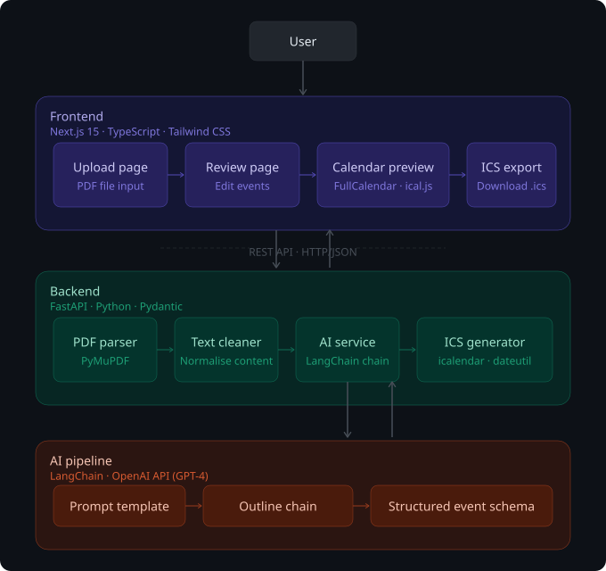

# Course Outline to Calendar

**Live Demo:** [course-outline-to-calendar.vercel.app](https://course-outline-to-calendar.vercel.app/)

## Demo
[Watch the demo](https://www.youtube.com/watch?v=I6ASMBjhsgM)

## Overview

Course Outline to Calendar is an AI-powered web application that automatically converts course outline PDFs into structured calendar events. The application removes the need for students to manually extract dates, times, and schedules from academic documents and recreate them in digital calendars.

By uploading a course outline, users can generate a fully populated, importable `.ics` calendar file containing lectures, assignments, exams, office hours, and other academic events.

---

## Architecture



## Table of Contents

- [Overview](#overview)
- [Features](#features)
- [Tech Stack](#tech-stack)
- [Prerequisites](#prerequisites)
- [Installation](#installation)
- [Running the Project](#running-the-project)
- [Usage](#usage)
- [Project Structure](#project-structure)
- [API Documentation](#api-documentation)
- [Contributing](#contributing)

## Overview

Students rely on digital calendars to manage lectures, assignments, tests, exams, and office hours. Although all of this information is provided by instructors in course outlines, these documents are typically distributed as static PDF files that are difficult to navigate efficiently.

Students must repeatedly scan course outlines to locate important dates and times, then manually create individual calendar events. This process is time-consuming, repetitive, and prone to error, especially when managing multiple courses.

This application solves this problem by automatically converting course outlines into calendar events. Simply upload a course outline PDF, review the extracted events, and download an .ics calendar file that can be imported into Google Calendar, Apple Calendar, or Outlook.

## Features

- 📄 **PDF Upload & Text Extraction**: Upload course outline PDFs and extract text content
- 🤖 **AI-Powered Event Detection**: Automatically identify lectures, assignments, exams, and office hours using LangChain and OpenAI
- ✏️ **Interactive Event Editor**: Review and edit extracted events before export
- 📅 **Calendar Preview**: Visualize events in a calendar view using FullCalendar
- 📥 **ICS Export**: Generate .ics files compatible with major calendar applications
- 🔄 **Recurring Events Support**: Handle recurring lectures and events using RRULE

## Tech Stack

### Frontend
- **Framework**: Next.js 15 (React)
- **Language**: TypeScript
- **Styling**: Tailwind CSS
- **UI Components**: Radix UI, shadcn/ui
- **Calendar**: FullCalendar
- **ICS Handling**: ical.js
- **Animations**: Framer Motion
- **Notifications**: Sonner

### Backend
- **Framework**: FastAPI (Python)
- **AI/LLM**: LangChain, OpenAI API
- **PDF Processing**: PyMuPDF
- **Calendar Generation**: icalendar
- **Data Validation**: Pydantic
- **Date Parsing**: dateutil

### Infrastructure
- **Package Manager (Frontend)**: npm
- **Package Manager (Backend)**: pip/conda
- **Development**: Docker Compose (optional)

## Prerequisites

Before running this project, ensure you have the following installed:

- **Node.js** (v18 or higher) and npm
- **Python** (v3.9 or higher)
- **OpenAI API Key** (for AI-powered event extraction)

## Installation

### 1. Clone the Repository

```bash
git clone <repository-url>
cd course-outline-to-calendar
```

### 2. Backend Setup

```bash
cd backend

# Create and activate a virtual environment (recommended)
python -m venv venv
source venv/bin/activate  # On Windows: venv\Scripts\activate

# Install dependencies
pip install -r requirements.txt

# Create a .env file with your OpenAI API key
echo "OPENAI_API_KEY=your_api_key_here" > .env
```

### 3. Frontend Setup

```bash
cd frontend

# Install dependencies
npm install
```

## Running the Project

### Development Mode

You need to run both the backend and frontend servers:

#### Terminal 1: Start Backend Server

```bash
cd backend
source venv/bin/activate  # If using virtual environment
uvicorn main:app --reload --port 8000
```

The backend API will be available at `http://localhost:8000`

#### Terminal 2: Start Frontend Server

```bash
cd frontend
npm run dev
```

The frontend will be available at `http://localhost:3000`

### Using the Development Script (Optional)

```bash
# Make the script executable
chmod +x scripts/dev_start.sh

# Run both servers
./scripts/dev_start.sh
```

### Production Build

#### Backend
```bash
cd backend
uvicorn main:app --host 0.0.0.0 --port 8000
```

#### Frontend
```bash
cd frontend
npm run build
npm start
```

## Usage

1. **Navigate** to `http://localhost:3000`
2. **Upload** a course outline PDF using the file upload interface
3. **Review** the automatically extracted events in the preview section
4. **Edit** any events that need adjustments (dates, times, titles, locations)
5. **Preview** events in the calendar view
6. **Download** the generated .ics file
7. **Import** the .ics file into your preferred calendar application

## API Documentation

Once the backend is running, visit:
- **Swagger UI**: `http://localhost:8000/docs`
- **ReDoc**: `http://localhost:8000/redoc`

### Key Endpoints

- `POST /api/upload` - Upload course outline PDF
- `POST /api/extract` - Extract text from PDF
- `POST /api/events` - Process text and extract events
- `POST /api/calendar/generate` - Generate .ics file
- `GET /api/calendar/{session_id}` - Download generated calendar

Users are provided with a review interface that allows them to inspect, edit, or remove events before exporting the final calendar.

---

## Features

- Upload course outline PDFs for automated processing
- Extract lectures, assignments, exams, and office hours
- Detect recurring events and deadlines
- Flag ambiguous or incomplete information for user review
- Preview and edit events before export
- Generate `.ics` files compatible with Google Calendar, Apple Calendar, and Outlook

---

## System Architecture

The application consists of three main layers:

- **Frontend**: A Next.js (React) application responsible for file upload, event review, editing, and calendar export
- **Backend**: A FastAPI server that handles PDF parsing, data validation, event structuring, and calendar generation
- **AI Pipeline**: A LangChain-based extraction pipeline that identifies calendar-relevant information from cleaned course outline text

---

## Project Structure
```
course-outline-to-calendar/
│
├── README.md
├── docker-compose.yml
├── scripts/
│   ├── dev_start.sh              # Development startup script
│   └── cleanup_uploads.py
│
├── docs/                         # Documentation
│   ├── background.md
│   ├── problem-statement.md
│   ├── solution.md
│   ├── functional-requirements.md
│   ├── implementation-plan.md
│   └── demo-flow.md
│
├── frontend/                     # Next.js React application
│   ├── package.json
│   ├── next.config.js
│   ├── tsconfig.json
│   └── src/
│       ├── app/                  # Next.js app routes
│       │   ├── page.tsx         # Main upload page
│       │   ├── layout.tsx
│       │   └── review/          # Event review page
│       ├── components/          # React components
│       │   ├── FileUpload.tsx
│       │   ├── EventEditor.tsx
│       │   ├── EventPreview.tsx
│       │   ├── CalendarPreview.tsx
│       │   └── ui/             # shadcn/ui components
│       ├── services/           # API integration
│       │   └── api.ts
│       ├── types/              # TypeScript types
│       └── styles/             # Global styles
│
├── backend/                     # FastAPI Python application
│   ├── requirements.txt
│   ├── main.py                 # FastAPI entry point
│   ├── config.py               # Configuration
│   ├── api/
│   │   ├── routes/            # API endpoints
│   │   │   ├── upload.py
│   │   │   ├── extract.py
│   │   │   ├── events.py
│   │   │   ├── calendar.py
│   │   │   └── combined.py
│   │   └── dependencies.py
│   ├── services/              # Business logic
│   │   ├── pdf_parser.py
│   │   ├── text_cleaner.py
│   │   ├── ai_service.py
│   │   ├── event_validator.py
│   │   ├── event_storage.py
│   │   └── ics_generator.py
│   ├── models/                # Data models
│   │   └── event.py
│   └── utils/                 # Helper functions
│       ├── date_parser.py
│       ├── recurrence_helper.py
│       └── error_handler.py
│
├── ai/                        # AI processing pipeline
│   ├── prompts/
│   │   └── extract_events.txt
│   ├── chains/
│   │   └── course_outline_chain.py
│   └── schemas/
│
└── data/                      # Runtime data
    ├── uploads/              # Uploaded PDFs (temporary)
    ├── calendars/            # Generated .ics files
    └── sample_outlines/      # Sample course outlines
```

## Environment Variables

Create a `.env` file in the `backend` directory:

```env
# OpenAI Configuration
OPENAI_API_KEY=your_openai_api_key_here

# Optional: Model configuration
OPENAI_MODEL=gpt-4

# Optional: Server configuration
BACKEND_PORT=8000
FRONTEND_URL=http://localhost:3000
```

## Troubleshooting

### Backend Issues

**ImportError or ModuleNotFoundError**
```bash
# Ensure virtual environment is activated
source venv/bin/activate

# Reinstall dependencies
pip install -r requirements.txt
```

**OpenAI API Errors**
- Verify your API key is set in `.env`
- Check API key validity and credits at platform.openai.com

### Frontend Issues

**Module not found errors**
```bash
# Clear node_modules and reinstall
rm -rf node_modules package-lock.json
npm install
```

**Port already in use**
```bash
# Use a different port
npm run dev -- -p 3001
```

## Contributing

1. Fork the repository
2. Create a feature branch (`git checkout -b feature/amazing-feature`)
3. Commit your changes (`git commit -m 'Add some amazing feature'`)
4. Push to the branch (`git push origin feature/amazing-feature`)
5. Open a Pull Request

## License

This project is licensed under the MIT License.

## Acknowledgments

- Built with [Next.js](https://nextjs.org/)
- Backend powered by [FastAPI](https://fastapi.tiangolo.com/)
- AI integration using [LangChain](https://www.langchain.com/) and [OpenAI](https://openai.com/)
- UI components from [shadcn/ui](https://ui.shadcn.com/)

---

**Made with ❤️ for students tired of manual calendar setup**


**Deliverable:** Stable, demo-ready MVP

---

## Team Work Assignment, Responsibilities & Dependencies

**Team Size:** 4 Engineers

### Global Dependency (Applies to Everyone)

#### Event Data Model & API Contract (Highest Priority)

- **Must be defined and locked early in Phase 1**
- **Shared by Engineers 1, 2, 3, and 4**

The application uses a unified calendar event schema shared across the frontend, backend, and AI pipeline.

### Required Fields
- `title`
- `startDateTime`
- `endDateTime`
- `location`

### Optional Fields
- `description`
- `recurrence`
- `needsReview`

This schema is defined early and treated as stable to avoid integration issues.

---

## Technology Stack

### Frontend
- Next.js
- React
- TypeScript
- Tailwind CSS

### Backend
- FastAPI
- Python
- Pydantic

### AI / NLP
- LangChain
- OpenAI API

### Calendar Generation
- iCalendar (.ics) standard

---

## Getting Started

### Prerequisites

- Node.js 18 or later
- Python 3.10 or later
- Git
- OpenAI API key (or compatible provider)

---

## Installation

### 1. Clone the Repository
```bash
git clone https://github.com/your-username/course-outline-to-calendar.git
cd course-outline-to-calendar
```

### 2. Environment Configuration

Create environment files for both the backend and frontend.

#### Backend Environment Variables

Create a `.env` file inside the `backend/` directory with the following contents:
```env
OPENAI_API_KEY=your_api_key_here
```

If additional environment variables are required, refer to `.env.example`.

#### Frontend Environment Variables

Create a `.env.local` file inside the `frontend/` directory with the following contents:
```env
NEXT_PUBLIC_API_URL=http://localhost:8000
```

### 3. Backend Setup

It is strongly recommended to use a Python virtual environment.

Create and activate the virtual environment:
```bash
cd backend
python3 -m venv .venv
source .venv/bin/activate
```

Install backend dependencies:
```bash
pip install -r requirements.txt
```

Run the backend server:
```bash
uvicorn main:app --reload --port 8000
```

Verify that the backend is running by visiting:
```
http://127.0.0.1:8000/docs
```

### 4. Frontend Setup

In a new terminal window, install frontend dependencies:
```bash
cd frontend
npm install
```

Start the frontend development server:
```bash
npm run dev
```

The application will be available at:
```
http://localhost:3000
```

---

## Usage

1. Open the application in your browser
2. Upload a course outline PDF
3. Review the extracted calendar events
4. Edit, add, or remove events as needed
5. Export the final calendar as a `.ics` file
6. Import the file into your preferred calendar application

---

## Testing

Backend tests are located in the `backend/tests/` directory.

Run tests with:
```bash
cd backend
pytest
```

---

## Demo Flow

Upload → Review → Edit → Export → Import

---

## License

MIT License
